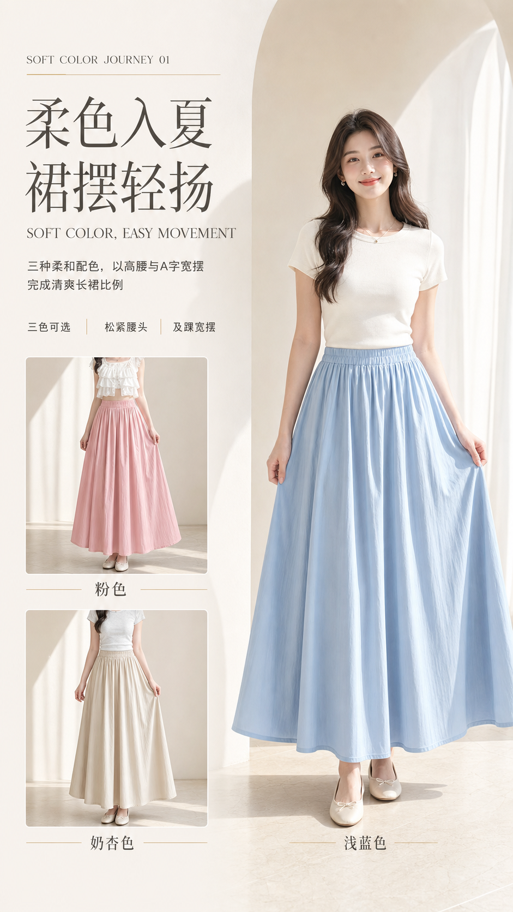
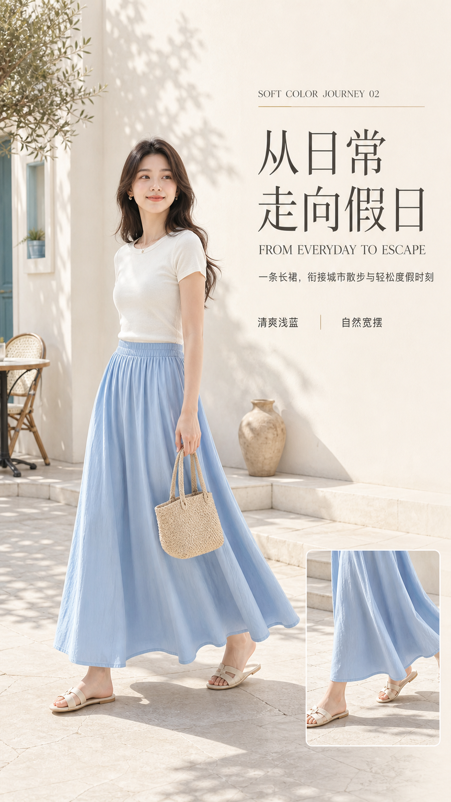
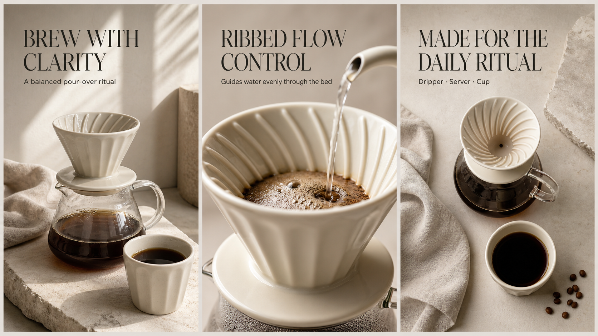

# Product Detail Images

English | [中文](./README.zh.md)

Turn one or more product references into a complete, conversion-oriented ecommerce detail-image series. This Skill helps merchants, operators, and visual creators plan the sales narrative, choose a coherent art direction, write page-level copy, generate the images, and review the final set as one commercial system.

## Preview

### Fashion detail-image series

<p align="center">
  
  
  
</p>

The fashion example shows how one product story can move from recognition to usage imagination and construction detail without repeating the same pose or layout.

### Product series overview



The coffee preview is an original fictional product example generated for this repository. Together, the two categories demonstrate varied page roles, camera distances, compositions, copy hierarchy, and background worlds.

## Who Is This For?

- Ecommerce operators building marketplace detail pages
- Product and brand teams turning limited source material into a complete visual plan
- Designers and content creators who need consistent image prompts, copy, and quality control
- Agent users who want more than isolated attractive posters

## What It Does

The Skill first identifies the primary product and available evidence, then builds a complete commerce story before deciding how many images to use. It presents seven visual directions, recommends the strongest fit, maps every page to a distinct sales job, and generates the series in controlled batches with post-generation review.

## Core Capabilities

| Capability | What it helps you do |
| --- | --- |
| Product and evidence analysis | Separate visible product facts from unsupported claims and creative expression |
| Category routing and adapters | Route the main decision type automatically; structured durables, packaged consumables, and electronics load specialized structure, packaging, sensory, function, and evidence rules |
| Complete page planning | Cover recognition, core value, advantages, proof, usage imagination, and purchase decisions |
| Stable image-count logic | Use 6, 8, or 10 images according to story depth and source richness instead of arbitrary output counts |
| Platform and format routing | Distinguish product images, detail modules, social cards, ads, and video covers before choosing a canvas |
| Seven style directions | Compare seven product-specific visual styles and select one coherent series direction |
| Page-level copywriting | Give every image useful commercial copy without CTA buttons or empty decorative pages |
| Layout and typography control | Vary composition, camera distance, pose, product scale, and text hierarchy while preserving series consistency |
| Background reconstruction | Treat source images as product evidence and rebuild a background world that fits the product |
| Generation quality control | Review product identity, anatomy, crops, text, claims, page meaning, and whole-series rhythm |
| Mechanical dimension validation | Check raw aspect ratios and final pixel dimensions without stretching the product or layout |

## Platform Compatibility

Validated against the Codex Skill schema and tested with Codex on macOS. The core Skill uses portable Markdown instructions and relative files. Claude Code, OpenClaw, Linux, and Windows compatibility has been statically reviewed; the helper scripts require Python 3.9 or later, while full image generation depends on the host Agent.

Full image generation requires the host Agent to provide an image-generation tool. The optional structured-brief validator requires Python 3.9 or later. Run it with `py -3 scripts\validate_product_brief.py <brief.json>` on Windows, or `python3 scripts/validate_product_brief.py <brief.json>` on macOS and Linux.

## Install

Send this to your Agent:

```text
Install this Skill for me:
https://github.com/chemny/product-detail-images
```

The Agent will choose the installation method for the current client, check dependencies, and verify that the Skill loads.

## Quick Start

After installation, start a fresh task and send:

```text
Use $product-detail-images with these product images. Identify the primary product, recommend a complete image count and visual style, then show me the full page plan and copy before generating anything.
```

The Skill stops for one consolidated confirmation before image generation.

## Usage Examples

```text
Use $product-detail-images to build a complete detail-image plan for this dress. Show all seven style options, recommend one, and explain the sales job of every page.
```

```text
Use $product-detail-images for these three product photos. The handbag is the primary product. Rebuild the background world and generate an eight-image detail series after I approve the plan.
```

```text
Use $product-detail-images to plan a complete detail-image series for this electronic product. Inventory appearance, interfaces, functions, components, specifications, and compatibility evidence before showing all seven styles and asking for one consolidated confirmation.
```

```text
Review this generated product-detail series with $product-detail-images. Identify only the failed dimensions and propose targeted prompt revisions.
```

## How It Works

1. Lock the primary product and exclude distracting products.
2. Analyze visible features, source richness, evidence, and claim boundaries, then route the product to the applicable category rules.
3. Build a complete commerce story and select the smallest complete 6-, 8-, or 10-image skeleton.
4. Compare seven visual styles, recommend one, and map each page's image-text relationship.
5. Confirm the plan once, then generate the hero and later pages in controlled batches.
6. Inspect raw aspect ratios and final pixel dimensions, then review delivery quality and creative quality, revising only the failed dimension.

## Repository Structure

```text
product-detail-images/
├── SKILL.md
├── README.md
├── README.zh.md
├── LICENSE
├── agents/
│   └── openai.yaml
├── assets/
│   ├── fashion-series-hero.png
│   ├── fashion-series-lifestyle.png
│   ├── fashion-series-detail.png
│   └── product-detail-series-preview.png
├── references/
│   ├── background-system.md
│   ├── category-routing.md
│   ├── packaged-consumable-adapter.md
│   ├── electronics-adapter.md
│   ├── structured-durable-adapter.md
│   ├── platform-format-routing.md
│   ├── poster-sequence.md
│   ├── style-packs.md
│   └── ...
└── scripts/
    ├── validate_product_brief.py
    └── validate_image_dimensions.py
```

## Requirements

- An Agent client that can load local Skills
- An image-generation capability for final image production
- Product images or a sufficiently specific product description
- Python 3.9 or later when using the optional structured-brief or image-dimension validators

The planning workflow remains useful without the optional validator. Image-generation availability and behavior depend on the current Agent client.

## License

Released under the [MIT License](./LICENSE). The preview image is an original fictional example for this repository. Product images supplied by users remain subject to their original rights and permissions.
